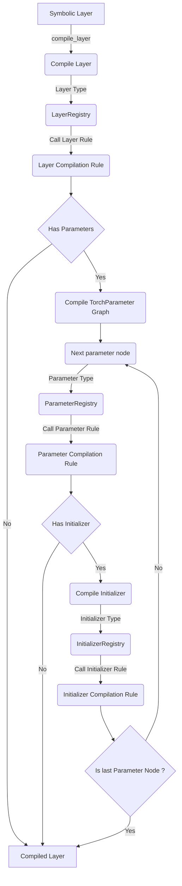

# Compilation

## Circuit Compilation Algorithm (`TorchCompiler._compile_circuit`)

Data structures:

- `compiled_layers_map`: dictionary storing mapping between symbolic layers and
  compiled layers.
- `in_layers`: dictionary storing the _links_ between layers (adjacency list).
  That is, for each layer, store a list of input nodes.

Algorithm :

1. For every layer in topological order:
   1. Call the `compile_layer` method.
   1. Store the mapping between the compiled and symbolic layers in `compiled_layers_map`.
   1. Store the mapping between the new compiled layer and its compiled inputs
      in the `in_layers` dictionary.
      _Due to the topological order, the inputs are guaranteed to be already
      stored in `compiled_layers_map`_
2. Once all the layers are compiled, create the sequence `outputs` which stores
   the compiled output layers. To do so, you just retrieve the compiled layers
   corresponding to the symbolic circuit's output layers.
3. Create the fully compiled circuit, a `TorchCircuit` object, using the
   mappings and sequence previously built.
4. Run the circuit post processing function `TorchCompiler._post_process_circuit`
   (optimization and folding).
5. Initialize all the parameters of the circuit (`TorchCircuit.reset_parameters`).
   It's a function that recursively calls the compiled initializer of all the
   circuit's parameters.
6. Register the compiled circuit in the `CompiledCircuitsMap`.

## Layer Compilation Process (`TorchCompiler.compile_layer`)

The function, in itself, only retrieves the layer _rule_ corresponding to the
input type from the `CompilerLayerRegistry` and applies it.
Here is a flowchart describing the process of compiling a single layer:

As we can see, the compilation rule of a layer might call the compilation rule
of a parameter which might itself call the compilation rule of an initializer.
Furthermore, as `TorchParameter` objects are graphs themselves, we need to iterate
through all parameter nodes to compile them.

### Compile a Parameter Graph (`TorchCompiler.compile_parameter`)

Data structures:

- `compiled_nodes_map`: dictionary storing mapping between symbolic parameter
  nodes and compiled parameter nodes.
- `in_nodes`: dictionary storing the _links_ between nodes.
  That is, for each nodes, store a list of input nodes.
- `nodes`: list of compiled nodes.

Algorithm:

1. For every parameter node in topological order:
   1. Call the `_compile_parameter_node` method.
   1. Store the mapping between the compiled and symbolic node in `compiled_nodes_map`.
   1. Store the mapping between the new compiled node and its compiled inputs
      in `in_nodes`.
      _Due to the topological order, the inputs are guaranteed to be already
      stored in `compiled_nodes_map`_
   1. Store the compiled node in `nodes`.
2. Once all the nodes are compiled, create the sequence `outputs` which stores
   the compiled output nodes. To do so, you simply retrieve the compiled nodes
   corresponding to the parameter graph output nodes.
3. Create the fully compiled graph, a `TorchParameter` object, using the
   mappings and sequence previously built.
