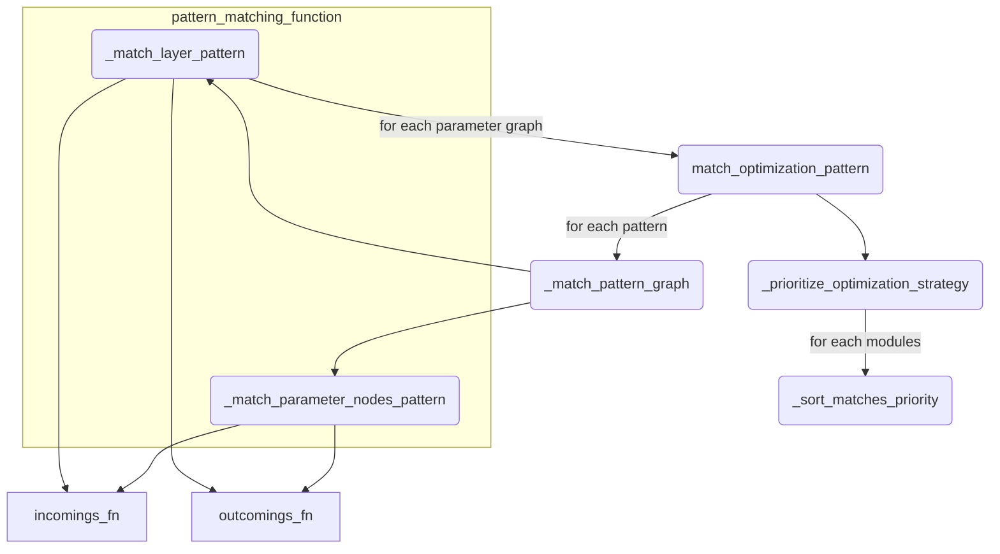
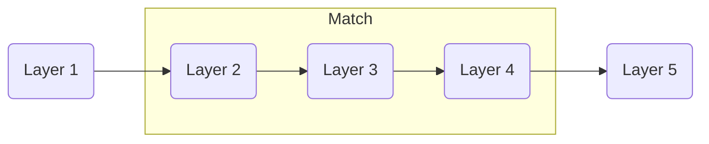

# Optimization

## Optimization Patterns

### Intro

Before diving into the optimization algorithms, let us first understand
how cirkit detects possible optimizations.

Currently, cirkit can perform three optimizations on Torch graphs:

- Merge / Fuse nodes in `TorchParameter` graphs.
- Merge / Fuse layers in the compiled circuit (`TorchCircuit`).
- Shatter one layer into multiple layers in the compiled circuit.

To describe the configuration of layers / nodes that are searched,
cirkit uses _patterns_.

Here is a graph recapitulating how the functions interact.



### The `match_optimization_patterns` Function

This function is the high level matching "engine", handling all the
logic to return all high priority matches given a graph and a set
of patterns.

It takes as input:

- The elements of the graph as an iterable of `TorchModuleT`.
- The outputs of the graph as an iterable of `TorchModuleT`.
- A list of patterns to search in the graph.
- A function that returns the inputs of a given modules.
- A function that returns the outputs of a given modules.
- A **pattern matching function** that returns a list of `GraphOptMatch`.
- An optimization strategy.

We will see later what exactly a pattern matching function is.

High Level Algorithm:

1. Iterate through all patterns and search for matches in the graph.
   (Uses `_match_pattern_graph`)
2. Call `_prioritize_optimization_strategy` to get a dictionary
   keeping exactly one match per matched node. (one node could
   match with multiple pattern).

It returns a list of `GraphOptMatch` (See [Storing Matches in GraphOptMatch](#storing-matches-in-graphoptmatch))
and a dictionary mapping the root module that matched a pattern (the first
module in the `entries` list) and the corresponding `GraphOptMatch`.

#### Optimization Strategy

The optimization strategy is a value from an enumeration that
defines how to pick the most important match when a node matches
several patterns.

Currently, only one strategy is implemented:

- `OptMatchStrategy.LARGEST_MATCH` which counts the number of
  modules involved in the match and keeps the one with the highest count.

#### The `_match_pattern_graph` Function

It is a simple function that tests a given pattern on all modules
in an iterable.

### Pattern Declaration

There are two types of patterns; both inherits the generic
interface `GraphOptPatternDefn`:

- `ParameterOptPattern` for patterns on `TorchParameter` graphs.
- `LayerOptPattern` for patterns on `TorchCircuit`.

The pattern class can define up to 4 methods to describe the pattern.

#### Output layers only: `is_output()`

Returns True to search the pattern only in the output layers.

#### Base pattern: `entries()`

Returns an ordered sequence of layer / parameter node types that need to be
matched _when going through the graph in the reverse topological order_.

_Example_, the entry `[LayerType3, LayerType2]` will match the graph:

`LayerType1 -> LayerType2 -> LayerType3 -> LayerType4`

The match will be the graph rooted at `LayerType3`.

#### Match layer with specific configuration: `config_patterns()`

Returns a list of dictionaries that map a config name to a config value.
The "config" of a layer / parameter node is simply the dictionary returned
by `Layer.config`.
The dictionary at position x in the list defines the config for the x-th element of
the `entries` list.

_Example_, The sum layer with config:

```python
{
  "num_input_units":2,
  "num_output_units":1,
  "arity":1
}

```

Will match the

```python
class ExamplePattern(LayerOptPatternDefn):
  def config_patterns():
    return [{"arity":1}]
  def entries():
    return [TorchSumLayer]
```

#### Matching parameters of a layer: `sub_patterns()`

Returns a list of dictionaries that map a layer's parameter names to a `ParameterOptPattern`.
The dictionary at position x in the list defines the config for the x-th element of
the `entries` list.

Example: you can match the weight parameter of a sum layer to be of a certain `ParameterType`:

```python
class LayerPatternOne(LayerOptPatternDefn):
  @classmethod
  def entries(cls) -> Sequence[type[TorchLayer]]:
    return [TorchSumLayer]

  @classmethod
  def sub_patterns(cls) -> Sequence[dict[str, ParameterOptPattern]]:
    return [{"weight": ParameterPatternOne}]

class ParameterPatternOne(ParameterOptPatternDefn):
    @classmethod
    def entries(cls) -> list[type[TorchParameterNode]]:
        return [ParameterType]
```

`LayerPatternOne` will match the following layer:

```python
TorchSumLayer(1,1,1,weight=ParameterType(...))
```

_`ParameterOptPattern` only uses `is_output()` and `entries()`_

### Storing Matches in `GraphOptMatch`

`GraphOptMatch` is an abstract class which stores:

- A pattern.
- A list of modules matching the pattern (`entries`).
- A list of dictionaries storing, for each element in `entries`, a mapping between
  a parameter's name and the associated matches (from `sub_patterns()`).

There are two implementations of this abstract class :

- `ParameterOptMatch`
- `LayerOptMatch`

These objects will be built by **pattern matching functions**.

### Pattern Matching Functions

#### General Idea

A pattern matching function takes as arguments:

- A _starting node_ for the matching process.
- A pattern to search.
- A function that returns the inputs of a given module.
- A function that returns the outputs of a given module.

It returns either an instance of `GraphOptMatch` if the pattern matches,
or `None` if the pattern fails.

There are two pattern matching functions in
`cirkit.backend.torch.compiler.py`:

- `_match_parameter_nodes_pattern`
- `_match_layer_pattern`

Because the logic of `_match_layer_pattern` includes the logic of
`_match_parameter_nodes_pattern`, we first describe the logic for
parameters and then explain the additional logic used for layers.

#### Parameter Pattern Matching (`_match_parameter_nodes_pattern`)

The function is given a _starting node_ as parameter.

Data structures:

- A list, `matched_nodes`, that will store each node that is parts of the pattern.

Algorithm:

1. Set the _current node_ as the value of the _starting node_.
2. For every entry in the pattern's `entries()`:
   1. Return `None` if the current node is not the current entry.
   2. Return `None` if the current node has more than one input and is not the
      last entry.

      _This condition is necessary as the algorithm cannot handle trees or
      DAGs yet_

   3. Return `None` if the current node has more than one output and is not the
      first entry.

      _This condition is necessary because we cannot fuse layers if another
      branch of the graph requires the output of an intermediate layer._

      Example:

      ```mermaid
      flowchart LR
        subgraph Fuse["Fuse"]
                L2("Layer 2")
                L1("Layer 1")
        end
        inp["Input"] --> L1("Layer 1")
        L1 --> L2
        L2 --> L3("Layer 3")
        L1 --> L4("Layer 4")
        style Fuse stroke:#C8E6C9,fill:#C8E6C9
      ```

      In this example, if we fused the layer, we could not connect to Layer 4 !

   4. Add the current node to `matched_nodes`.
   5. Finally, if the current entry is not the last, replace the current node
      with the only input of the current node.

      **Note** that we technically do not provide any guarantee that the node has
      input; it is possible to create a malformed pattern that would create an error.

3. If the code reaches the end of the loop, it means the pattern matches;
   we return a new `ParameterOptMatch` containing the pattern and `matched_nodes`.

#### Layer Pattern Matching (`_match_layer_pattern`)

The algorithm is similar to `_match_parameter_nodes_pattern` with the additional
checks for `config_patterns` and `sub_patterns`.

Data structures:

- `matched_layers`: a list to store the layers that are in the pattern.
- `matched_parameters`: a list to store the parameters corresponding to the
  layers in the pattern.

Algorithm:

1. Set the _current layer_ to the _starting layer_.
2. For every entry in the pattern's `entries` property, indexed by a variable `lid`:
   1. Same as in `_match_parameter_nodes_pattern`.
   2. Same as in `_match_parameter_nodes_pattern`.
   3. Same as in `_match_parameter_nodes_pattern`.
   4. For each pair (`config_name`, `config_value`) in the dictionary at
      the `lid`-th position in `config_patterns`:
      1. If the value of the `config_name` field in the current layer is not equal
         to `config_value`, return `None`.
   5. Create `lpmatches`, an empty dictionary to store the matches corresponding
      to each parameter.
   6. For each pair (`parameter_name`, `parameter_pattern`) in the dictionary at
      the `lid`-th position in `sub_patterns`:
      1. Retrieve the `TorchParameter` graph corresponding to `parameter_name`.
      2. Call `match_optimization_patterns` using the graph and `parameter_pattern`.
      3. Return `None` if no parameter match.
      4. Store the matches for the parameters in `lpmatches`.
   7. Add `lpmatches` to the list `matched_parameters`.
   8. Finally, if the current entry is not the last, replace the current node
      with its sole input.
3. Finishing the loop means that the pattern is matching; we return a new
   `LayerOptMatch` object containing the pattern, the `matched_layers` and
   the `matched_parameters`.

## Applying Matched Patterns

### Optimization Rules

Pattern rules are classes inheriting from either `ParameterOptApplyFunc`
or `LayerOptApplyFunc`. These two interfaces require the implementation
of the `__call__` method as follows:

```python
def __call__(
        self, compiler: TorchCompiler, match: ParameterOptMatch
    ) -> tuple[AbstractTorchModule, ...]: ...
```

Because the interface only requires an implementation of the `__call__` method,
any function with the right signature will be correct.

A rule acts as a function that for a given compiler and match,
returns a tuple of torch modules to replace those matched by the pattern.

### Optimizer Registries

The `TorchCompiler` uses three optimizer registries to store the `pattern:rule`
associations:

- One `LayerOptRegistry` for patterns that _shatter_ layers.
- One `LayerOptRegistry` for patterns that _fuse_ layers.
- One `ParameterOptRegistry` for patterns that act on parameter nodes.
  (Only fuse for now)

The two layer registries are stored in a dictionary called `_layer_optimization_registry`
and the parameter registry is stored in the variable `_parameter_optimization_registry`.

### Match Optimizer (`match_optimizer_fn`)

To apply matches to the graph, we define short functions that retrieve the
match in the correct registry, apply the rule and return the resulting tuple.

**Important**: these functions return a tuple in _topological_ order!

These functions are directly defined _inside_ `_optimize_parameter_nodes` and
`_optimize_layers`. They act as _closures_ in the sense that they access the
compiler object from the context of the outer function.

## Optimize Graph Function (`optimize_graph`)

### Principle

This function is the common entry point to optimize both layers and parameters.

It takes as arguments:

- The list of Torch modules in the graph to optimize, in topological order.
- The list of Torch modules acting as the graph's outputs.
- The patterns to search for.
- A function that returns the inputs of the given module.
- A function that returns the outputs of the given module.
- A function that tries to match a pattern using the given node as the root.
- A function that takes a match as parameter and returns the tuple of modules
  to replace it.
- The optimization strategy deciding which match should be applied.

It returns either:

- The list of all modules in the optimized graph.
- The adjacency dictionary of the optimized graph.
- The list of modules from the optimized graph that are outputs.

Or `None` if no optimizations were found (no matches).

### Data structures

To reconstruct the new graph, the algorithm requires several variables:

- `match_opt_modules`: a dictionary that maps matches with tuples of
  optimized modules that are returned by the optimization rules.
- `modules`: the list of modules for the optimized graph.
- `in_modules`: the adjacency list of the optimized graph.
- `match_entry_points`: a dictionary that stores the first module,
  in topological order, in the sub graph defined by the match.
- `match_exit_points`: a dictionary that stores the last module,
  in topological order, in the sub graph defined by the match.
- `opt_outputs`: the list of output modules in the optimized graph.

`match_entry_points` and `match_exit_points` are used to connect the new
modules to the correct input and output layers / nodes.

For example, if we have this graph:



The entry point is Layer 2, and the exit point is Layer 4. We can
then reconstruct the optimized graph by connecting the new modules
to the entry and exit points:


### Algorithm

1. Run `match_optimization_patterns` to retrieve all the optimization
   matches to apply.
2. If there are no matches, return `None`.
3. For each match, run the match optimizer function `match_optimizer_fn`
   which applies the optimization rules and collect the optimized tuples
   in `match_opt_modules`.
4. For each module in the graph, in topological order:
   1. If the module does not appear in a match:
      1. Add it to `modules`.
      2. Construct the `in_modules` entry by retrieving the input of
         the current module. Check for each input module if they has
         been replaced by an optimized module.
   2. If the match has no entry in `match_entry_points`, then it means
      the current module is the first in the match. Register it as the
      entry point in the mapping.
   3. If the current module is the root of the match (exit point):
      1. Add the optimized modules to `modules`.
      2. For each optimized module:
         1. If it's the first module in the topologically ordered tuple:
            Use the input of the match's `match_entry_points` to
            construct the entry in `in_modules`.
         2. Otherwise, feed the previous optimized module as input to the
            current one in `in_modules`.
      3. Register the final optimized module of the match as an exit
         point in `match_exit_points`.
5. Finally, construct the list of `opt_outputs` from the outputs of
   the original graph, consulting `match_exit_points` when output module
   has been replaced.

## Optimizing the Full Circuit (`_optimize_circuit`)

### General Algorithm

This function takes as parameters:

- The current Torch compiler, containing the optimization registries.
- The circuit to optimize.
- A maximum number of optimization steps.

Because our pattern matching logic only applies the most important optimization
for a given module (based on the priority strategy), we iterate
several times through the optimization procedure to ensure we apply all
possible optimizations.

It works like this:

1. While there are still optimizations possible and the current step is not
   the maximum number of optimization steps:
   1. Try optimizing the parameter nodes.
   2. Try optimizing the layers using the shatter patterns
   3. Try optimizing the layers using the fusion patterns.
   4. If at least one step returned an optimized circuit, continue the loop.
2. Return the optimized circuit.

### Optimizing Parameters (`_optimize_parameter_nodes`)

This function takes as parameters:

- The current Torch compiler, containing the optimization registries.
- The circuit to optimize.

The function will:

1. Retrieve the parameter registry and create a match optimizer.
2. For each layer in the circuit:
   1. For each parameter in the layer:
      1. Call the `optimize_graph` function.
      2. If the result is `None`, go to the next layer.
      3. Otherwise, replace the original parameter graph with the optimized one.
3. If one parameter graph was optimized, return the circuit and `True`.
4. Otherwise, return the circuit and `False`.

### Optimizing Layers (`_optimize_layers`)

This function takes as parameters:

- The current Torch compiler, containing the optimization registries.
- The circuit to optimize.
- A boolean variable specifying the type of optimization we want to apply.
  Either `True` to shatter or `False` to fuse.

Depending on the boolean variable, the function will:

1. Retrieve the right registry and match optimizer.
2. Call the `optimize_graph` function.
3. If the results is `None`, return the current circuit and `False`.
4. Otherwise, construct a new circuit from the optimized modules returned by
   `optimize_graph` and the information from the original compiled circuit.
5. Return the optimized circuit and `True`.

## Existing Implementations

### Existing Patterns

The default patterns for **layers** are stored in `cirkit/backend/torch/optimization/layers.py`.
You can find the mapping defined at the end of the file:

- `DEFAULT_LAYER_FUSE_OPT_RULES` for layer fusion patterns.
- `DEFAULT_LAYER_SHATTER_OPT_RULES` for layer shattering patterns.

The default patterns for **parameters** are stored in `cirkit/backend/torch/optimization/parameters.py`.

- `DEFAULT_PARAMETER_OPT_RULES` for parameter graph patterns.

You can find a list of [implemented patterns](./optimization_implemented.md) in
a separate file.

### Existing Strategies

There is only one **strategy** implemented as of today: the `LARGEST_MATCH` strategy.

The strategies are declared in the `OptMatchStrategy` enumeration in
`cirkit/backend/torch/graph/optimize.py`.
