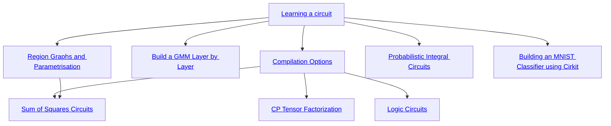

# Running Notebooks


```bash
pip install ".[notebooks]"
jupyter notebook
```


# Suggested Path through Notebooks


While you can explore the notebooks in any order, we recommend you start from the **learning-a-circuit.ipynb** notebook, and proceed as in the graph below.



