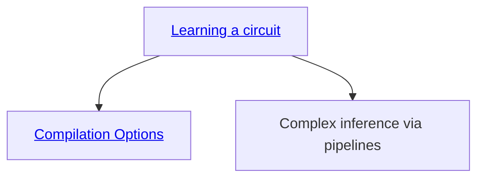

# Running notebooks


```bash
pip install ".[notebooks]"
jupyter notebook
```


# Suggested Path


While you can explore the notebooks in any order, we recommend you start from [learning a circuit](learning-a-circuit.ipynb) and proceed as in the graph below.



